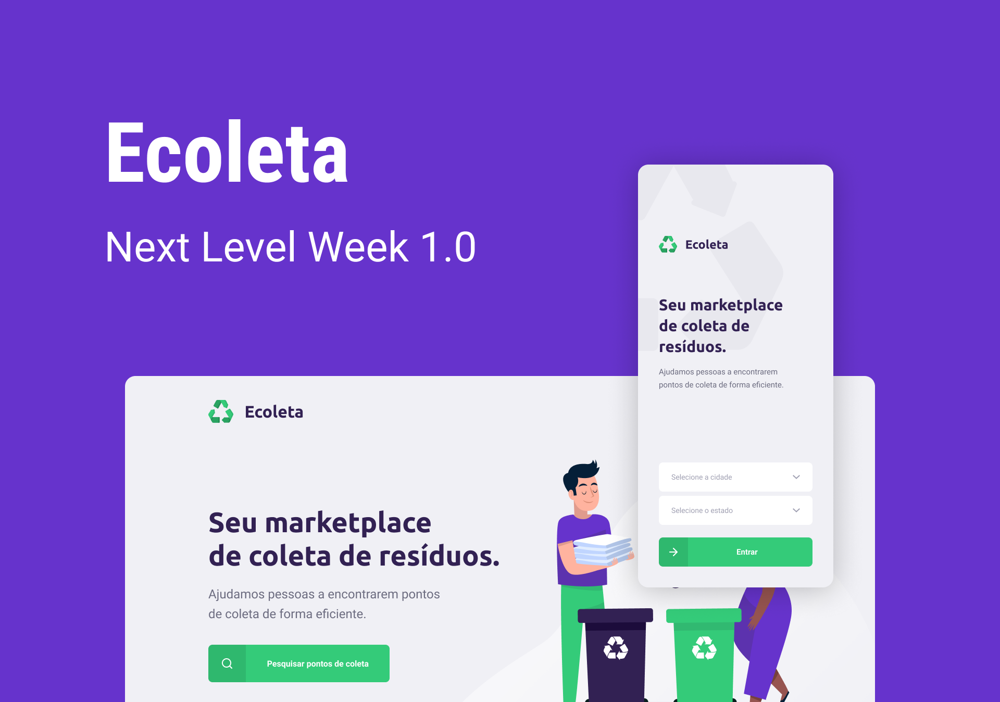
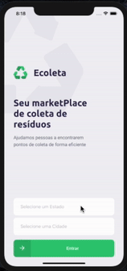

<p align="center">
   
</p>


# Ecoleta Mobile
<p align="center">

[](https://github.com/LeoAlvarenga)
[](#)
[](#)

</p>

<p align="center">
    
</p>


> The Mobile App of the Ecoleta project built on the Next Level Week by Rocketseat, where we built a full application with the Back-end in Node, Front-end in React and the Mobile in React-Native. You can see the the [Web App](https://github.com/LeoAlvarenga/Ecoleta-Web) and the [API](https://github.com/LeoAlvarenga/Ecoleta-API) clicking on the links. Technologies such as expo and typescript and some libraires such as react-native-maps, expo-icons and RNPickerSelect were used in this project.

# Installation

**You need to install [Node.js](https://nodejs.org/en/download/) and [Git](https://git-scm.com/) first, alson make shure you're runnig the API Server of the Ecoleta project (you can find it right [here](https://github.com/LeoAlvarenga/Ecoleta-API)) then in order to clone the project via HTTPS, run this command:**

```git clone https://github.com/LeoAlvarenga/Ecoleta-Mobile.git```

SSH URLs provide access to a Git repository via SSH, a secure protocol. If you have a SSH key registered in your Github account, clone the project using this command:

```git clone git@github.com:LeoAlvarenga/Ecoleta-Mobile.git```


**Instal Dependecies**
```npm install```

# Getting Started

Open the project directory and Run the following command on terminal
```expo start```
